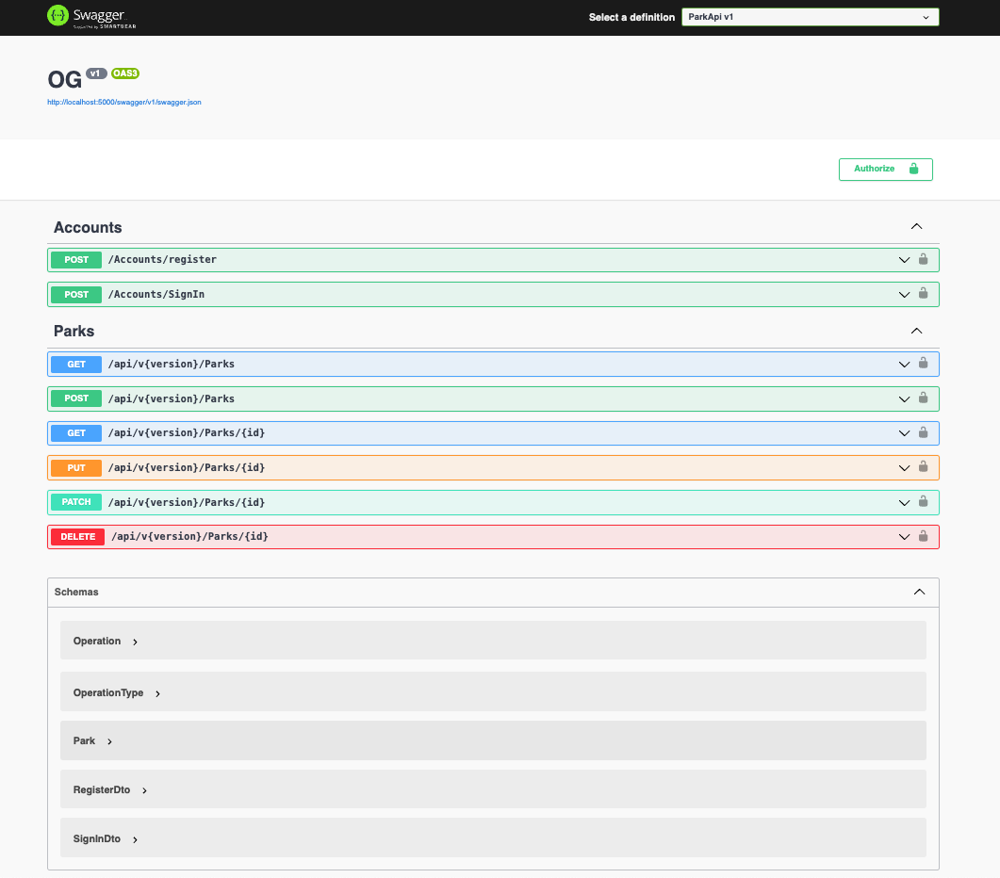

<p align="center">
  <big><b>Park Finder API</b></big>
</p>
    <!-- <br>
    <p align="center">
    
    </p>
    <br /> -->
    <!-- GitHub Link -->
    <p align="center">
        by <a href="https://github.com/kimmykokonut">
            <strong>kimmykokonut</strong>
        </a>
    </p>
    <!-- Project Shields -->
    <p align="center">
        <a href="https://github.com/kimmykokonut/Park-Api/stargazers">
            
        </a>
        ¨
        <a href="https://github.com/kimmykokonut/Park-Api/issues">
            
        </a>
        ¨
        <a href="https://github.com/kimmykokonut/Park-Api/blob/main/LICENSE">
            
        </a>
        ¨
        <a href="https://www.linkedin.com/in/robinson-kim/">
            
        </a>
    </p>    
</p>
    <p align="center">
    
    </p>

<p align="center">
  <small>Initiated February 23rd, 2024. </small>
</p>
<!-- Project Links -->
<p align="center">
    <a href="https://github.com/kimmykokonut/Park-Api"><big>Project Docs</big></a> ·
    <a href="https://github.com/kimmykokonut/Park-Api/issues"><big>Report Bug</big></a> ·
    <a href="https://github.com/kimmykokonut/Park-Api/issues"><big>Request Feature</big></a>
</p>

------------------------------
### <u>Table of Contents</u>
* <a href="#🌐-about-the-project">About the Project</a>
    * <a href="#📖-description">Description</a>
    * <a href="#🦠-known-bugs">Known Bugs</a>
    * <a href="#🛠-built-with">Built With</a>
    <!-- * <a href="#🔍-preview">Preview</a> -->
* <a href="#🏁-getting-started">Getting Started</a>
    * <a href="#📋-prerequisites">Prerequisites</a>
    * <a href="#⚙️-setup-and-use">Setup and Use</a>
* <a href="#🛰️-api-documentation">API Documentation</a>
* <a href="#🤝-contributors">Auxiliary</a>
    * <a href="#✉️-contact-and-support">Contact</a>
    * <a href="#⚖️-license">License</a>
    * <a href="#🌟-acknowledgements">Acknowledgements</a>
    
------------------------------

## 🌐 About the Project

### 📖 Description
An API that functions as a park archive for state and federal parks in the United States.  It utilizes RESTful principles and pagination. The user is able to see the in-use version of the API when using Postman.  This is an independent project for Epicodus code school to demonstrate skills in building an API.

<!-- version control, and has integrated authentication to keep the API Read-Only for all users except administrators. -->

### 🦠 Known Bugs

* There was an issue with query parameters in ParksController when I tried to minimize code using terneray operators.  Reverting back to multiple if statements, it is now functional.
* Can't delete readme lines 4-8 without losing formatting
* In top of readme, it does not recognize the MIT license

### Stretch Goals
* JWT Tokens
* CORS
* For future UI: a weather api call to display current weather at selected park, a map api call to display park's location on a map

### 🛠 Built With


* [ASP.NET Core MVC](https://docs.microsoft.com/en-us/aspnet/core/mvc/overview?view=aspnetcore-3.1)

* [Entity Framework Core](https://docs.microsoft.com/en-us/ef/core/)

------------------------------

## 🏁 Getting Started

### 📋 Prerequisites

#### Install .NET Core
* On macOS Mojave or later
  * [Click here](https://dotnet.microsoft.com/download/thank-you/dotnet-sdk-2.2.106-macos-x64-installer) to download the .NET Core SDK from Microsoft Corp for macOS.
* On Windows 10 x64 or later
  * [Click here](https://dotnet.microsoft.com/download/thank-you/dotnet-sdk-2.2.203-windows-x64-installer) to download the 64-bit .NET Core SDK from Microsoft Corp for Windows.

#### Install dotnet script
 Enter the command ``dotnet tool install -g dotnet-script`` in Terminal for macOS or PowerShell for Windows.

#### Install MySQL Workbench & Community Server
 * [MacOs: Download and install MySQL Workbench, version 8.0](https://dev.mysql.com/downloads/workbench/).
 * [MacOS: Download and install MySQL Community server .dmg file, version 8.0](https://dev.mysql.com/downloads/mysql/).
 * [Windows 10/11: Install & configure MySQL database, version 8.0](https://downloads.mysql.com/archives/get/p/25/file/mysql-installer-web-community-8.0.19.0.msi).

#### Install Postman
(Optional) [Download and install Postman](https://www.postman.com/downloads/).

#### Code Editor

  To view or edit the code, you will need a code editor or text editor. The open-source code editor I used is VisualStudio Code.

  1) Code Editor Download: [VisualStudio Code](https://www.npmjs.com/)
  2) Click the download most applicable to your OS and system.
  3) Wait for download to complete, then install -- Windows will run the setup exe and macOS will drag and drop into applications.

### ⚙️ Setup and Use

  #### Cloning

  1. Navigate to the [Park API repository](https://github.com/kimmykokonut/Park-Api).

  2. Click the `Fork` button and  you will be taken to a new page where you can give your repository a new name and description. Choose "create fork".

3. Click the `Code` button and copy the url for HTTPS.

4. On your local computer, create a working directory for this project and name appropriately (i.e. ParkApi.Solution)

5. In this new directory, via the terminal, type `$ git clone https://github.com/kimmykokonut/Park-Api`.

6. Run the command `cd Park-Api` to enter into the project directory.

7. Once you have this on your local directory, if you ever want to push it to GitHub, you need to do these steps first so Git knows to ignore the desired directories and files:
`$ git init` to initialize Git and
`$ touch .gitignore` adds .gitignore file in the root directory. (if cloning, this step already automatically happened, it is good practice to double check.)

8. View or Edit: On your terminal, type `$ code .` to open the project in VS Code.

9.  Ensure the .gitignore file contains:
```
> bin
> obj
> appsettings.json
```
Once confirmed, ensure sensitive files are not shared to GitHub by commiting .gitignore file before appsettings.json is created. Via terminal:
```
$ git add .gitignore
$ git commit -m 'add .gitignore'
$ git push origin main
```

  #### Protect DB Connection string with appsettings.json

  1) Create a new file in the ParkApi.Solution/ParkApi directory named `appsettings.json`
  2) Add in the following code snippet to the new appsettings.json file, replacing the following with your own:
  ```
    [YOUR-USERNAME] with your username
    [YOUR-PASSWORD] with your MySql password (set at MySql installation)
    [YOUR-DB-NAME] with the name of your database
  ```

  ParkApi.Solution/ParkApi/appsettings.json
  ```
  {
  "Logging": {
    "LogLevel": {
      "Default": "Information",
      "Microsoft.AspNetCore": "Warning"
    }
  },
  "AllowedHosts": "*",
  "ConnectionStrings": {
    "DefaultConnection": "Server=localhost;Port=3306;database=[YOUR-DB-NAME];uid=[YOUR-USERNAME];pwd=[YOUR-PASSWORD];"
    }
  }
  ```
 #### Log info that is relevant to ASP.NET Core adn EF Core in appsettings.Development.json

 1) Create a new file in the ParkApi.Solution/ParkApi directory named `appsettings.Development.json`
  2) Add in the following code snippet to this file:
```
{
  "Logging": {
    "LogLevel": {
      "Default": "Information",
      "Microsoft": "Trace",
      "Microsoft.AspNetCore": "Information",
      "Microsoft.Hosting.Lifetime": "Information"
    }
  }
}
```
#### ...Back to VSCode's Terminal...
 While in the terminal, navigate to the project's production directory called "ParkApi" and type `$ dotnet build` to compile the application's code and install all needed dependencies (this creates the bin folder).  Type `$ dotnet restore` to create the obj folder.

#### Database
  We will use migrations to create a new database based on our code. 
1. Install dotnet ef globally (if not already installed)
`$ dotnet tool install --global dotnet-ef --version 6.0.0`
2.  If you need to make any changes to the Models or their properties, do it now, this next step will create your database based on that data.
3. Create a migration now (and any time you change your Models) (name = Initial for your first migration, then a descriptive name for future migrations):
`$ dotnet ef migrations add <MigrationName>`
5. Update the database with the migrations:
`$ dotnet ef database update`
6. IF you make a mistake and haven't pushed the changes to GitHub you can revert the last migration
`$ dotnet ef migrations remove`

#### Launch the API
1) Navigate to ParkApi.Solution/ParkApi directory using the MacOS Terminal or Windows Powershell.
2) Run the command `dotnet run` to have access to the API in Postman or browser via swagger `http://localhost:5000/swagger/index.html`.
3) You can close the server at anytime by entering `ctrl` + `c` in the terminal. 

------------------------------

## 🛰️ API Documentation
Explore the API endpoints in Postman or a browser.

### Using Swagger Documentation 
To explore the Park API with Swagger, launch the project using `dotnet run` with the Terminal or Powershell, and input the following URL into your browser: `http://localhost:5000/swagger`

<!-- ### Using the JSON Web Token
In order to be authorized to use the POST, PUT, DELETE functionality of the API, please authenticate yourself through Postman.
* Open Postman and create a POST request using the URL: `http://localhost:5000/api/users/authenticate`
* Add the following query to the request as raw data in the Body tab:
```
{
    "UserName": "CoffeeAdmin",
    "Password": "epicodus"
}
```
* The token will be generated in the response. Copy and paste it as the Token paramenter in the Authorization tab.

### Note on CORS
CORS is a W3C standard that allows a server to relax the same-origin policy. It is not a security feature, CORS relaxes security. It allows a server to explicitly allow some cross-origin requests while rejecting others. An API is not safer by allowing CORS.
For more information or to see how CORS functions, see the [Microsoft documentation](https://docs.microsoft.com/en-us/aspnet/core/security/cors?view=aspnetcore-2.2#how-cors). -->

### Note on Pagination
The Park API returns a default of 10 results per page at a time, up to a maximum of 100.

To modify this, use the query parameters `pageNumber` and `pageSize` to alter the response results displayed. The `pageSize` parameter will specify how many results will be displayed per page (max 100), and the `pageNumber` parameter will specify which page of results to retrieve.

#### Example Query
```
https://localhost:5000/api/Parks?pageNumber=2&pageSize=3'
```

To use default, _don't include_ `pageNumber` and `pageSize` or set them equal to zero.

..........................................................................................

### Endpoints
Base URL: `https://localhost:5000`

#### HTTP Request Structure
```
GET /api/{component}  
POST /api/{component}  
GET /api/{component}/{id} 
PUT /api/{component}/{id} 
PATCH /api/{component}/{id} 
DELETE /api/{component}/{id} 
```

#### Example Query
```
https://localhost:5000/api/Parks/3
```

#### Sample JSON Response
```
{
  "parkId": 3,
  "name": "Joshua Tree",
  "designation": "Federal",
  "description": "Two distinct desert ecosystems, the Mojave and the Colorado, come together in Joshua Tree National Park. A fascinating variety of plants and animals make their homes in a land sculpted by strong winds and occasional torrents of rain. Dark night skies, a rich cultural history, and surreal geologic features add to the wonder of this vast wilderness in southern California",
  "city": "Twentynine Palms,",
  "state": "CA",
  "webUrl": "https://www.nps.gov/jotr/index.htm",
  "photoUrl": "https://www.nps.gov/jotr/planyourvisit/images/lost-horse-valley_2.jpg?maxwidth=1300&autorotate=false&quality=78&format=webp",
  "entryFee": true,
  "feeType": "$30/day, $55/year",
  "campground": true,
  "latLong": "lat:33.881866, long:-115.900650",
  "yearEst": 1994
}
```

...........................................................

### Parks
Access information on parks within the United States.

#### HTTP Request
```
GET /api/Parks   | Gets list of parks in database
POST /api/Parks   | Creates new park object
GET /api/Parks/{id}   | Gets park by id number
PUT /api/Parks/{id}   | Edits entire park object
PATCH /api/Parks/{id}   | Edits one property of park object
DELETE /api/Parks/{id}   | Deletes park object by id
```

#### Path Parameters
| Parameter | Type | Default | Required | Description |
| :---: | :---: | :---: | :---: | --- |
| name | string | none | true | Return matches by name.
| designation | string | none | true | Return parks based on 'Federal' or 'State' status. |
| city | string | none | false | Return park matches by city input. |
| state | string | none | true | Return park matches by state code (WA). |
| free | boolean | none | false | If true, returns parks with no entry fee. |
| campground | boolean | none | false | If true, returns parks that contain campgrounds. |
| over100years | int | none | false | If query is 1, returns parks that have been established for 100 years or more. |

#### Example Query
```
https://localhost:5000/api/Parks/?state=MT&over100years=1
```

#### Sample JSON Response
```
{
    "parkId": 1,
    "name": "Glacier National Park",
    "designation": "Federal",
    "description": "A showcase of melting glaciers, alpine meadows, carved valleys, and spectacular lakes. With over 700 miles of trails, Glacier is a paradise for adventurous visitors seeking wilderness steeped in human history. Relive the days of old through historic chalets, lodges, and the famous Going-to-the-Sun Road.",
    "city": "West Glacier",
    "state": "MT",
    "webUrl": "https://www.nps.gov/glac/index.htm",
    "photoUrl": "https://roadtrippers.com/wp-content/uploads/2020/03/shutterstock_1141638494-1160x921.jpg",
    "entryFee": true,
    "feeType": "$35/day, $80/year",
    "campground": true,
    "latLong": "lat:48.6962778, long:-113.7178611",
    "yearEst": 1910
  }
```
#### Example Post Action to add a park to the database
POST request to:
```
http://localhost:5000/api/Parks
```
with an object literal in the body of the API call: (Never include a parkId property, that value is set by the database)
```
{
  "name": "Red Rock",
  "designation": "State",
  "description": "Two distinct desert ecosystems, the Mojave and the Colorado, come together in Joshua Tree National Park. A fascinating variety of plants and animals make their homes in a land sculpted by strong winds and occasional torrents of rain. Dark night skies, a rich cultural history, and surreal geologic features add to the wonder of this vast wilderness in southern California",
  "city": "",
  "state": "AZ",
  "webUrl": "https://azstateparks.com/red-rock",
  "photoUrl": "https://www.aopa.org/-/media/Images/AOPA-Main/News-and-Media/2017/October/Sedona-Arizona/1005_Sedona1.jpg?mw=1200&mh=675&as=1&hash=16E9AF04A4B0FBD9ABA814BAAFA08486",
  "entryFee": true,
  "feeType": "$7/day/adult, $4/day/age 7-13, $0/under 7",
  "campground": false,
  "latLong": "lat:34.815200, long:-111.831380",
  "yearEst": 1986
}
```

#### Example PATCH Request (edit 1 property of object)
[learn more about Patch here](https://learn.microsoft.com/en-us/aspnet/core/web-api/jsonpatch?view=aspnetcore-8.0)
```
https://localhost:5000/api/Parks/3
```
json request body
```
[
  {
    "operationType": 0,
    "path": "/name", (property name)
    "op": "replace",
    "from": "Joshua Tree", (current value)
    "value": "Arches Park" (desired value)
  }
]
```
#### Sample JSON Patch Response
```
{
  "parkId": 3,
  "name": "Arches Park",
  "designation": "Federal",
  "description": "Two distinct desert ecosystems, the Mojave and the Colorado, come together in Joshua Tree National Park. A fascinating variety of plants and animals make their homes in a land sculpted by strong winds and occasional torrents of rain. Dark night skies, a rich cultural history, and surreal geologic features add to the wonder of this vast wilderness in southern California",
  "city": "Twentynine Palms",
  "state": "CA",
  "webUrl": "https://www.nps.gov/jotr/index.htm",
  "photoUrl": "https://www.nps.gov/jotr/planyourvisit/images/lost-horse-valley_2.jpg?maxwidth=1300&autorotate=false&quality=78&format=webp",
  "entryFee": true,
  "feeType": "$30/day, $55/year",
  "campground": true,
  "latLong": "lat:33.881866, long:-115.900650",
  "yearEst": 1994
}
```
------------------------------

### ✉️ Contact and Support

If you have any feedback or concerns, feel free to contact me

<p>
    <a href="https://github.com/kimmykokonut/Park-Api/issues">Report Bug</a> ·
    <a href="https://github.com/kimmykokonut/Park-Api/issues">Request Feature</a>
</p>

------------------------------

### ⚖️ License

MIT License. See license.md for further information
------------------------------

### 🌟 Acknowledgments

#### [Epicodus](https://www.epicodus.com/)
>"A school for tech careers... to help people learn the skills they need to get great jobs."

#### [LunsfordSpace](https://github.com/LunsfordSpace/CoffeeTrackerAPI.Solution-API-ReadMe-Example/blob/main/README.md)
> "for elevating the README"

------------------------------

<center><a href="#">Return to Top</a></center>